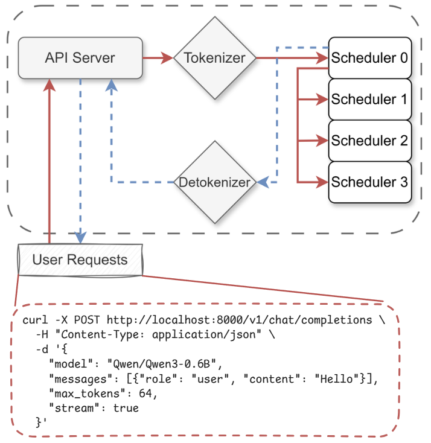
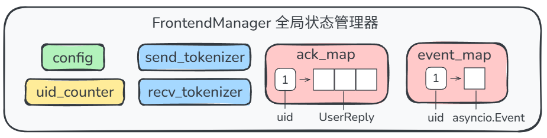
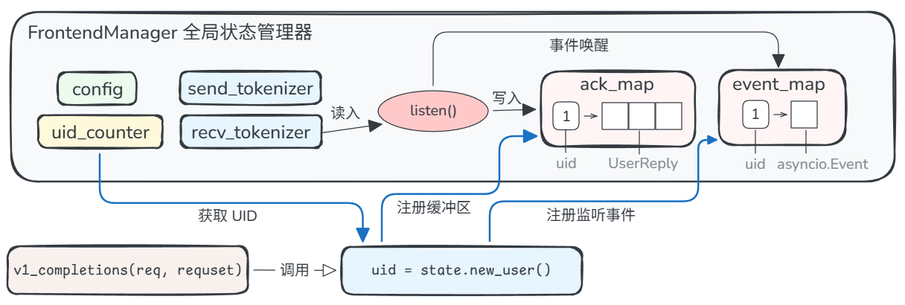
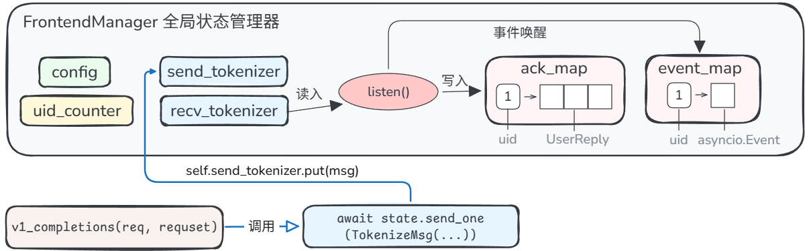
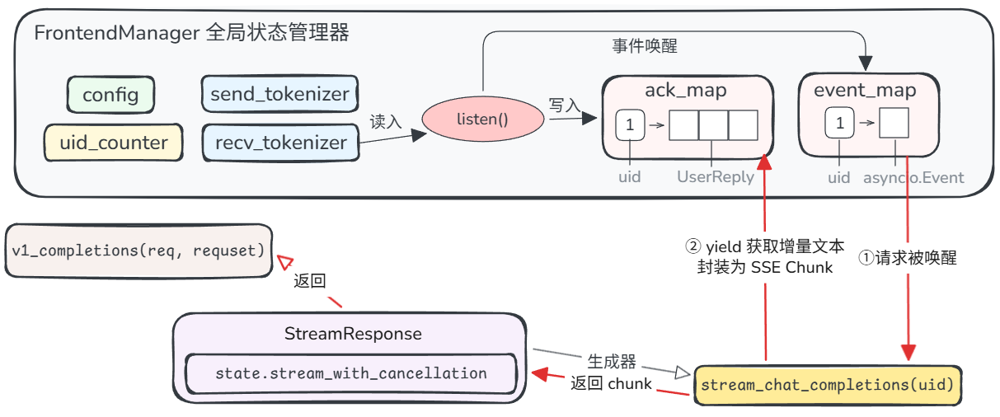
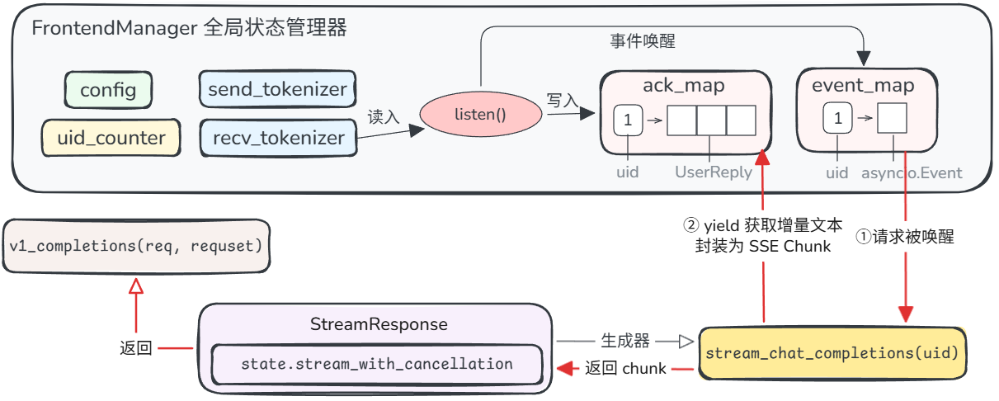
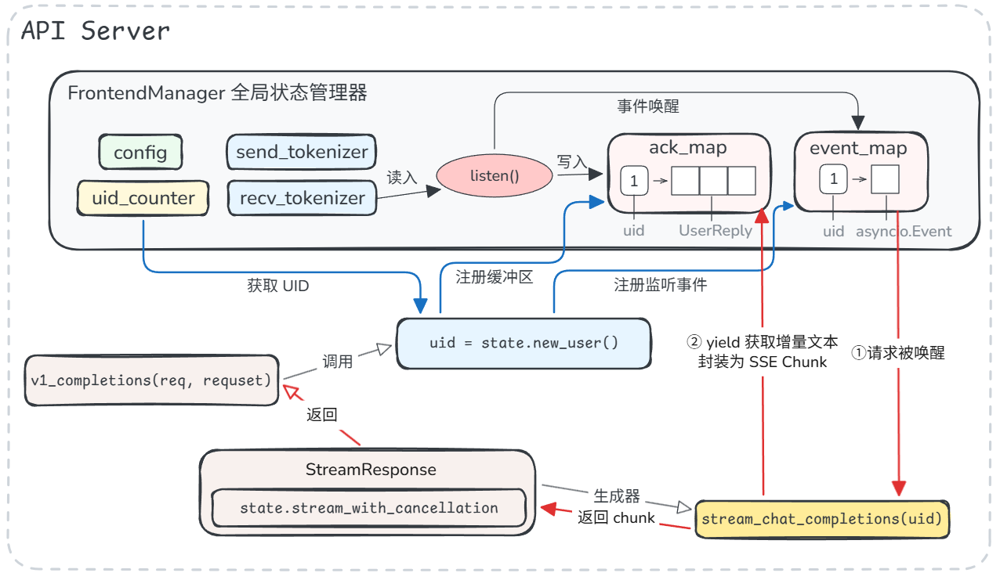

## 总体流程



## API Server

以 **Qwen/Qwen3-0.6B** 模型为例，启动 Mini-SGLang 推理服务，并向服务发送一个用户请求：
```bash
curl -X POST http://localhost:8000/v1/chat/completions \
  -H "Content-Type: application/json" \
  -d '{
    "model": "Qwen/Qwen3-0.6B",
    "messages": [{"role": "user", "content": "Hello"}],
    "max_tokens": 64,
    "stream": true
  }'
```

该请求首先被 `server/api_server.py` 中定义的 FastAPI 服务接口处理。

### 用户请求投递与响应 token 分发

在理解 LLM 服务的 API Server 设计逻辑之前，我们需要回顾一下传统 Web API 设计。

在传统 Web 服务中，请求进来后，服务器从线程池里取一个线程来处理它，最后完整返回响应结果，并将线程归还到线程池中。在这样的处理模型下，响应结果与其对应的请求天然绑定，不需要额外的判断。

但 LLM 推理引擎的计算特性（即，将多个请求拼接成一个大矩阵一起计算，作为计算结果的 token 可能交错返回：刚刚返回的 token 可能属于请求 1，下一个 token 可能属于请求 2），使我们在设计 API Server 层时，必须考虑这样一个问题：

**1. 如何将后端交错返回的 token，正确绑定到对应的请求上？**

在 API Server 中，我们可以为每个请求分配一个编号：

```python
@app.post("/v1/chat/completions")
async def v1_completions(req: OpenAICompletionRequest, request: Request):
    state = get_global_state() # 全局状态管理
    ...
    uid = state.new_user() 
    # 为新请求分配编号、分配缓冲区 ack_map、分配异步事件 asyncio.Event() 实例
    ...
    return StreamingResponse(
    state.stream_with_cancellation(state.stream_chat_completions(uid), request, uid),
        # 给 StreamingResponse 中的 stream 绑定 uid
        media_type="text/event-stream",
    )
```

这个 `uid` 将贯穿整个处理链路：API Server → tokenizer → scheduler → detokenizer → API Server。

在整条处理链路的最后一步，后端将 uid、增量文本、结束标记返回给 API Server：

```python
@dataclass
class UserReply(BaseFrontendMsg):
    uid: int # 关联请求的 uid
    incremental_output: str # 增量文本
    finished: bool # 是否结束
```

为请求分配编号之后，还需要考虑：

2. **如何全局维护编号与请求的对应关系以及其他相关信息？即，如何维护 API Server 的全局状态？**

FastAPI 提供的接口方法 `v1_completions` 应当是无状态的，我们需要在接口方法之外，创建一个能够跨请求共享的运行时管理器，即 `FrontendManager`，如图所示。



除了管理请求编号以外，它还包含其他需要被跨请求共享的信息：

```python
@dataclass
class FrontendManager:
    # 推理服务全局配置，如模型路径、最大并发请求数等
    config: ServerArgs
    # send/recv_tokenizer 是 API Server 与后端之间数据交互的通道
    send_tokenizer: ZmqAsyncPushQueue[BaseTokenizerMsg]
    recv_tokenizer: ZmqAsyncPullQueue[BaseFrontendMsg]
    # 编号计数
    uid_counter: int = 0
    initialized: bool = False
    # 维护当前正在处理的多个请求的响应 token 数据和事件
    ack_map: Dict[int, List[UserReply]] = field(default_factory=dict)
    event_map: Dict[int, asyncio.Event] = field(default_factory=dict)
```

当多个请求（要求流式响应）到达时，API Server 需要维护多个 HTTP 长连接。为了避免多个长连接持续轮询是否有新 token 产生，每个请求都在 `state.new_user` 方法中向 `FrontendManager` 注册一个 `asyncio.Event`，并在 `ack_map` 中注册获取自己的缓冲区 ，以“生产者-消费者”模式处理后端返回的 token，如图所示：



3. **如何将用户请求投递给后端？**

请求通过 `state.new_user()` 完成注册、获得 `uid` 后，将被 API Server 进一步包装为 `TokenizeMsg` 对象，并通过 `send_one` 方法，将请求数据通过 `send_tokenizer` 投递到后端，如图所示。

```python
await state.send_one(
    TokenizeMsg(
        uid=uid,
        text=prompt,
        sampling_params=SamplingParams(...),
    )
)
```



在等待后端返回 token 期间，请求在 `stream_chat_completions(uid)` 方法内部的`wait_for_ack()` 方法中调用 `await event.wait()` 挂起，直到事件通知。



**4. 后端返回 token 后，如何将其分发给对应请求？**

请求所等待的事件通知由 `FrontendManager` 触发，整体流程如图所示。

`FrontendManager` 实例通过 `listen()` 方法为所有请求统一监听 token 返回事件。它通过 `recv_tokenizer` 与后端直接通信。读到后端返回的一个 `UserReply` 对象后，它将该对象放进 `ack_map[uid]`，再调用 `event_map[msg.uid].set()` 方法唤醒对应的请求。

请求醒来后，继续执行`wait_for_ack()`方法：从缓冲区 `ack_map[uid]` 中取出数据，清空缓冲区，将数据 `yield` 给上一层 `stream_chat_completions(uid)` 方法。该方法拿到数据后，解析处理增量文本 `ack.incremental_output`，将其包装成 OpenAI 格式的 SSE chunk，然后继续 `yield` 给 `StreamingResponse`：

```python
async for ack in self.wait_for_ack(uid):
    ...
    if ack.incremental_output:
        delta["content"] = ack.incremental_output

    chunk = {
        "id": f"cmpl-{uid}",
        "object": "text_completion.chunk",
        "choices": [{"delta": delta, "index": 0, "finish_reason": None}],
    }
    yield f"data: {json.dumps(chunk)}\n\n".encode()
```

最后，`StreamingResponse` 是最终的流式响应，作为接口方法 `v1_completions` 的返回值返回给用户请求。

**整体上，API Server 的设计可以总结为下图：**



### ZMQ：与后端 tokenizer 进程通信

在前文中，我们笼统地将负责处理用户请求的部分称为后端。实际上，用户请求首先抵达分词器 tokenizer，经过分词处理后，才会进一步递交给推理引擎进行 token 计算；计算完毕的 token 还需要经过反分词处理，转换成自然语言文本后再返回给 API Server。

API Server 的通信对象是 tokenizer/detokenizer 两个进程，它使用 ZMQ（ZeroMQ）这一消息队列框架作为通信组件。`FrontendManager` 所持有的`send_tokenizer` 和  `recv_tokenizer` 分别是 `ZmqAsyncPushQueue` 对象和 `ZmqAsyncPullQueue` 对象，即 API Server 这一侧持有的 ZMQ 通信端口。

API Server 发给 tokenizer 的数据被封装为 `TokenizeMsg` 对象，包含 uid，请求文本和采样参数：

```python
@dataclass
class TokenizeMsg(BaseTokenizerMsg):
    uid: int
    text: str | List[Dict[str, str]]
    sampling_params: SamplingParams
```

以本章开头提供的请求参数为例，被封装为 `TokenizeMsg` 对象再经序列化之后的内容如下所示：

```json
{
    "__type__": "TokenizeMsg",
    "uid": 3,
    "text": [
        {"role": "user", "content": "hello"}
    ],
    "sampling_params": {
        "__type__": "SamplingParams",
        "temperature": 1.0,
        "top_k": -1,
        "top_p": 1.0,
        "ignore_eos": False,
        "max_tokens": 16,
    },
}
```

除了正常的用户 Prompt 以外，用户还可能发送取消请求。取消请求将被封装为 `AbortMsg`。取消请求不会被分配新的 `uid`，而是直接携带被取消的请求的 `uid`，同样通过 ZMQ 发送给 tokenizer。

值得注意的是，后端通过 ZMQ 向 API Server 返回消息时，并非对称地以 `DetokenizeMsg` 对象格式返回，而是使用 `BatchFrontendMsg` 对象，其`data` 字段包含多个用户的结果（`List[UserReply]`） ：

```python
@dataclass
class BatchFrontendMsg(BaseFrontendMsg):
    data: List[BaseFrontendMsg] 
    # UserReply 是 BaseFrontendMsg 的子类
```

`FrontendManager` 的 `listen` 方法将 `data` 字段拆开，按 uid 将 `Reply` 对象放回到对应请求的 `ack_map` 中。

那么 `DetokenizeMsg` 在哪里被使用呢？事实上，它存在于后端，是 `scheduler` 发给 `detokenizer` 的数据封装格式，不会被 API Server 直接收到：

```python
@dataclass
class DetokenizeMsg(BaseTokenizerMsg):
    uid: int
    next_token: int
    finished: bool
```

`detokenizer` 负责将其中的 `next_token` 转换为可读文本，包装成 `UserReply`后再发回给 API Server。



综上，API Server 与后端通信的完整消息链路如图所示：

1. API Server 收 HTTP JSON 请求后，将其内容封装为 `TokenizeMsg` 对象，通过 ZMQ 发给 tokenizer。
2. tokenizer 把其中的文本内容转成 `input_ids`，包装为 `UserMsg` 对象，通过 ZMQ 发给 scheduler。
3. scheduler 推理出 next_token 后，封装为 `DetokenizeMsg` 对象，通过 ZMQ 发给 detokenizer。
4. detokenizer 把 token id 转换为可读文本，并封装为 `UserReply` 对象后，通过 ZMQ 发回 API Server。
5. 最后 API Server 通过 `recv_tokenizer` 取出 `BatchFrontendMsg`，拆出其中的多个 `UserReply` 对象，处理成 SSE chunk 后，最终返回给 HTTP 客户端。

## Tokenizer & Detokenizer

默认情况下，tokenizer 和 detokenizer 属于同一个进程，在 `tokenizer/server.py` 中的 `tokenize_worker` 一并初始化（即 `TokenizeManager` 和 `DetokenizeManager`）。

`tokenize_worker` 管理一个消息循环，持续监听来自 ZMQ 的消息。为减少读取开销，它采用批量收集的方式，尽量多地收取队列中已有的消息后再进行处理，但不会刻意凑满某个消息数量：

```python
while len(pending_msg) < local_bs and not recv_listener.empty():
    pending_msg.extend(_unwrap_msg(recv_listener.get()))
```

消息数量达到 `local_bs`（推理服务启动时指定，默认为 1），或队列已空时，停止消息收集，开始处理。

它接收的消息分为以下三类：

1. 来自 API Server 的 `tokenize_msg`；
2. 来自 API Server 的 `abort_msg`；
3. 来自 Scheduler 的 `detokenize_msg`。

对于 `tokenize_msg` 和 `detokenize_msg`，`tokenize_worker` 分别调用 `TokenizeManager.tokenize()` 和 `DetokenizeManager.detokenize()` 进行处理，并将 token 结果分别封装为 `UserMsg` 和 `UserReply` ，多个 token 结果合并到一个消息对象，通过 ZMQ 投递到对应接收方。

`abort_msg` 的处理方式与 `tokenize_msg` 基本相同，但不会被封装为 `UserMsg`，而是封装为 `AbortBackendMsg`，该对象内只包含一个 `uid` 字段，用以表示要被取消的目标请求。

## Scheduler

### 一个请求的调度与计算流程

假设一个用户请求经过 API Server 与 tokenizer 的处理，以 `UserMsg` 格式经由 ZMQ 抵达 scheduler。在 scheduler 中，它需要经过 prefill 阶段（并在该阶段建立、利用 KV Cache），完成用户输入 prompt 的注意力矩阵计算后，再进入 decode 阶段，逐个产生新 token，并持续以 `DetoknizeMsg` 的格式返回给 detokenizer。

**预处理**。scheduler 在调度循环中，从 ZMQ 取出上文所述的 `UserMsg`。`UserMsg` 首先在 `_process_one_msg` 方法中被处理。我们需要保证用户输入的 prompt 长度 + 最大生成长度不会超过模型能承受的最大序列长度。例如，模型最大上下文为 8192，用户 prompt 已有 8000 个 token，则最多只能再生成 192 个 token。即使用户请求中已指定 `max_tokens=1024`，scheduler 也只从模型最大上下文角度考虑。此外，如果用户 prompt 本身 token 数就已经超过模型最大上下文，则会被直接丢弃，不做处理：

```python
input_len, max_seq_len = len(msg.input_ids), self.engine.max_seq_len
max_output_len = max_seq_len - input_len
if max_output_len <= 0:
    # 输入 prompt 本身已经超过最大上下文长度，无生成 token 的空间，直接丢弃
    return logger.warning_rank0(
        f"Input sequence length {input_len} exceeds {max_seq_len}, "
        f"request {msg.uid} is dropped."
    )
if msg.sampling_params.max_tokens > max_output_len:
    # 输入 prompt 未超最大上下文长度，但无法满足用户指定的 max_tokens，
    # 以 max_output_len 为 max_tokens
    msg.sampling_params.max_tokens = max_output_len
    logger.warning_rank0(
        f"Adjust max_tokens to {max_output_len} for request {msg.uid}."
    )
```

**Prefill 调度**。通过上下文长度检查的 `UserMsg` 不会马上进行 prefill 计算，而是先被转换为 `PendingReq` 对象，放入到 pending 队列中，归属`PrefillManager` 管理，等待 scheduler 的下一批次调度。当 `schedule_next_batch` 方法被调用时，pending 队列中的每一个 pending 请求都会被尝试加入（ `try_add_one(pending_req)` ）到本轮 prefill batch 中。

不是每个 pending 请求都能一次性完成 prefill 计算。对于长 prompt，可能要分多个轮次计算，每次只 prefill 一部分。因此，`try_add_one`方法考虑两种情况：

- `pending_req` 是之前已处理过一部分的长 prompt 请求。此时，该请求的相关 KV Cache 资源已经被分配过，则直接复用，继续处理当前部分。

- `pending_req` 是全新的请求。新请求要进入 prefill 阶段，必须先通过 `_try_allocate_one()` 申请资源：

  - 用 `CacheManager` 查 `prefix cache`，得到 `cache_handle`；
  - 向 `TableManager` 申请 `table_idx`；
  - 判断 KV cache 空间是否充足；
  - 如果有命中的 prefix，还会把匹配的 token/page 信息写进 token pool/page table。

  若资源不足，比如 `TableManager` 已无空闲槽位，或 KV Cache 空间不足，则该方法返回 `None`，最终结束本轮 prefill 调度，将调度结果包装为 `Batch(reqs=reqs, phase="prefill")` 返回。

接下来，prefill batch 送入 `_prepare_batch` 方法中的预处理管线，转换成 GPU 可执行的 `ForwardInput`。该预处理管线能处理 prefill 和 decode 两类请求 batch，步骤包括：

1. `pad_batch`：将 batch 内的请求 padding 到统一对齐长度，方便 CUDA Graph 以固定 shape 进行录制和回放。它只影响 decode batch。
2. `allocate_paged`：为每个请求在 paged KV Cache 中分配物理页。
3. `_make_positions`：生成每个 token 的位置编码，用于 attention 计算过程中的 RoPE 等位置编码计算。
4. `_make_input_tuple`：构建输入 token 的逻辑索引。
5. `batch.out_loc`：通过页表将逻辑索引映射到实际 KV Cache 的物理地址。
6. `_make_write_tuple`：构建输出 token 要写回的逻辑索引（即新生成的 token 写回到 token pool 的位置）。
7. `prepare_metadata`：准备 attention kernel 需要的元数据，如 page table、cache 长度等，供 kernel 调度使用。

上述处理完成后，attention 层可以知道这批请求应该怎么读对应 cache、怎么计算 RoPE、怎么计算 prefill/decode。最后，返回一个 `ForwardInput` 对象，包含请求 batch、请求的采样参数、input_tuple、write_tuple。

**Prefill 批处理**。`Engine.forward_batch()` 方法负责 prefill 的实际计算。Engine 将当前 batch 放入全局上下文，从而模型层可以通过 `get_global_ctx()` 看到当前 batch 是 prefill batch 还是 decode batch。对于 prefill batch，直接进行模型前馈计算（`model.forward()`）。

举个例子，假设当前计算的 prefill batch 只包含用户请求 A 和 B，其中：

- 请求 A 的 prompt 有 4 个 token：`A0 A1 A2 A3`
- 请求 B 的 prompt 有 3 个 token：`B0 B1 B2`

为了计算效率，这些 token 会被拼接成一个输入序列 `A0 A1 A2 A3 B0 B1 B2`。Scheduler 所准备的元数据将被同时传入，以区分每个请求的 token 边界，如 `[0, 4, 7]`，表示请求 A 的 token 范围为 `[0, 4)`，请求 B 的 token 范围为 `[4, 7)`。Attention kernel 会按这些边界分别计算两条序列。请求 A 的 token 只能看到请求 A 内部的历史 token；请求 B 的 token 只能看到请求 B 内部的历史 token，不会看到请求 A 的 token。

在 prefill 阶段，我们要为每个请求生成第一个输出 token。根据 Attention 计算原理，只需要每个请求最后一个位置的 hidden state：请求 A 用 `h3`（即模型看完 `A0...A3` 后的状态），请求 B 用 `h6`（即模型看完 `B0...B2` 后的状态）。然后把 `h3` 和 `h6` 分别送进 `lm_head`（Attention 架构中的线性转换层），得到两个词表 `logits`：第一个 `logits` 用来采样请求 A 的下一个 token，第二个 `logits` 用来采样请求 B 的下一个 token。

从而，`model.forward()` 最终返回 `logits`。`logits` 随后被送入采样流程，确定生成的 token，并将新 token 按先前确定的写回位置 `write_tuple` 写回到 GPU 上的 token_pool 中，以备进行下一轮 decode。

`forward` 完毕后，当前 prefill batch 中还能继续 decode （如还未达到最大长度）的请求将会被纳入到 `decode_manager` 管理，在下一轮 decode batch 调度中执行 decode 计算，继续生成新的 token。

注意，这一轮 prefill 计算中，每个请求都生成了一个新的 token。按前文所述，这个新 token 需要被 detokenizer 处理后转换为增量文本，返回给 API Server。因此，最后还需要执行 `_process_last_data`。

**新 token 返回**。在 `_process_last_data` 中，它按 batch 顺序遍历请求，完成新 token 与原始请求的绑定：

```python
for i, req in enumerate(batch.reqs):
    next_token = next_tokens_cpu[i] 
    # 获取当前请求的新 token
    # next_tokens_cpu[i] 和 batch.reqs[i] 是一一对应的
    req.append_host(next_token.unsqueeze(0))
    # 将新 token 追加到该请求在 CPU 侧的 token 序列中
    next_token = int(next_token.item())
    # 将 tensor 形式的 token id 转换为普通 int
    finished = not req.can_decode
    # 是否达到长度限制，要结束生成
    if not req.sampling_params.ignore_eos:
        # 用户是否忽略 EOS，如果不忽略，则模型生成 EOS 时，视为全部内容已经生成完毕
        finished |= next_token == self.eos_token_id
    reply.append(DetokenizeMsg(uid=req.uid, next_token=next_token, finished=finished))
    # 将 token 封装为发给 detokenizer 的消息
```

### 运行时状态管理

Scheduler 作为负责调度所有请求的 token 计算。某一时刻，Scheduler 的调度循环中同时存在以下处于不同处理阶段的请求：

- 请求刚刚开始处理，处于 prefill 阶段；
- 请求已进入 decode 阶段（正在逐 token 生成）；
- 请求将要被取消。
- 请求已结束，需要释放 KV cache。

Scheduler 需要管理这些请求所处的阶段、资源占用情况、并决定下一轮计算应执行哪些请求。SGLang 的核心机制 Radix Cache 也在 Scheduler 的 KV cache 管理中体现。
