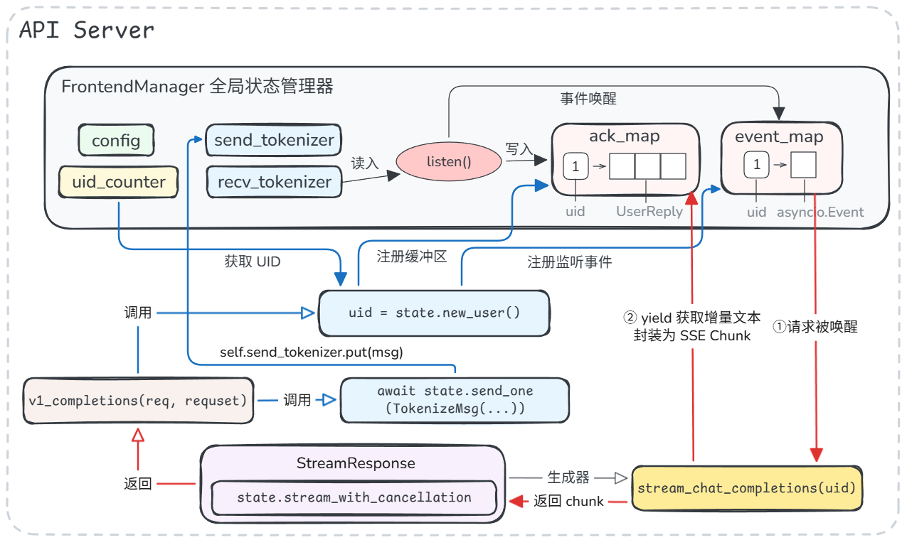

> **本篇已拆分为独立文章**：[Mini-SGLang 源码解析：从 HTTP 到 SSE，5 次消息投递](/notes/mini-sglang-request-flow/)
> 
> 原「一、请求处理全流程解析」一章已单独成篇（含全部配图），本篇保留 KV Cache 与推理优化两部分。

## 二、KV Cache 机制解析 

### 2.1 Paged KV Cache 实现

### 2.2 Radix Attention 与 Radix Cache 实现

Radix Cache 相关数据结构在 `kvcache/radix_cache.py` 中定义。（Radix Attention 指基于基数树复用 KV Cache 的注意力计算优化，其数据结构基础即本节讨论的 Radix Cache。）

`RadixTreeNode` 是基数树节点。对于一个节点，保存以下信息：

- `_key`：一段 token ids。一个节点保存一段 token，查找更紧凑。
- `_value`：这段 token 对应的 KV cache 索引，即页表中保存的物理位置。
- `children` 与 `_parent`：分别指向后续的多个分支节点及父节点。
- `ref_count`：引用计数，标记当前节点的 token ids 缓存正在被多少个请求引用。引用计数不为0的节点不能被删除。
- `timestamp`：时间戳，用来做淘汰策略。节点被访问时会更新时间。时间较旧的叶子节点优先被淘汰。

一个基数树节点可以通过 `split_at` 方法增加新分叉，如图所示：



---

`RadixCacheHandle` 负责在基数树上进行 prefix match，它只有一个方法 `get_matched_indices`：

```python
def get_matched_indices(self) -> torch.Tensor:
    node = self.node
    value_list: List[torch.Tensor] = []
    while not node.is_root():
        value_list.append(node.value)
        node = node.parent
    value_list.reverse()
    return torch.cat(value_list)
```

该方法会从当前节点出发，沿父节点一直走到 root，并将沿途所有节点的 `_value`  拼接起来，从而拿到完整命中前缀对应的 KV Cache 物理位置。

比如命中了 `A B C`，而树结构是 `root -> A B -> C`，那它会把 `A B` 的 value 和 `C` 的 value 拼起来，返回 `A B C` 前缀的完整索引。该索引随后会写入匹配该前缀的新请求的页表中，这样新请求就能指向并复用已有的 KV Cache。

---

`RadixPrefixCache` 是真正对外暴露的 cache 类。该类提供的方法较多，接下来我们以一个部分匹配已有前缀的用户请求为例，串联该类提供的各个方法。

设 `page_size = 2`，缓存里已经有历史请求留下的前缀（token ID）：`[10, 11, 12, 13, 14, 15]`。在基数树上，这个前缀体现为一个压缩节点：`root -> [10, 11, 12, 13, 14, 15]`。

现在来了新请求，其 prompt 为：`[10, 11, 12, 13, 20, 21]`，与缓存共享前 4 个 token：`[10, 11, 12, 13]`。

Schedule 调度该请求时，取其前 5 个 token 参与缓存匹配（这是为了保证留下至少一个 token 参与计算，用以预测新的 token）。

首先调用 `RadixPrefixCache` 的 `match_prefix` 方法：

```python
def match_prefix(self, input_ids: torch.Tensor) -> MatchResult:
    node, prefix_len = self._tree_walk(input_ids)
    return MatchResult(RadixCacheHandle(prefix_len, node))
```

其中，`_tree_walk` 是实际工作的方法，它先根据当前 token 的 page key 找到子节点，然后比较这个子节点与新请求剩余的其他 token 能匹配多少：

```python
while prefix_len < indice_len:
    child_node = node.children.get(self.key_fn(input_ids[prefix_len:]))
    if child_node is None:
        return node, prefix_len
    node = child_node  # walk to child node
    match_len = node.get_match_len(input_ids[prefix_len:])
    match_len = align_down(match_len, self.page_size)
    # align_down 保证匹配数量向下取整，如匹配了 5 个 token，但 page_size = 2 的情况下
    # 它只会匹配 4 个，以免产生只使用了一半的 page，便于维护
    prefix_len += match_len

    if match_len != node.length:
        node = node.split_at(match_len)
        return node, prefix_len
```

经过树上遍历后，新请求匹配的前缀确定为 `[10, 11, 12, 13]`。

然后，触发基数树节点的 `split_at(4)` 切分节点，将树从 `root -> [10, 11, 12, 13, 14, 15]` 变为 `root -> [10, 11, 12, 13] -> [14, 15]`。新产生的 `[10, 11, 12, 13]` 节点即公共前缀节点。`match_prefix` 返回的 `RadixCacheHandle` 对象指向这个公共节点，并且 cached_len = 4。

随后，Scheduler 方面使用这个`RadixCacheHandle` 对象，将命中的 KV page 填写到新请求自己的 page table 中：

```python
page_entry.copy_(handle.get_matched_indices())
```

随后带着命中的 KV page 进行 prefill 计算。在这里，prefill 计算的是新请求中未命中缓存的剩余两个 token id：` [20, 21]` 的 KV 值。算出` [20, 21]` 的 KV 值后，将执行 `insert_prefix` 方法，将新算出的 KV 值插回树上（写入缓存）：

```python
cached_len, new_handle = self.prefix_cache.insert_prefix(insert_ids, page_indices)
```

`insert_prefix` 中会再次 `_tree_walk`。在走到公共节点 `[10, 11, 12, 13]` 后，发现没有 `[20, 21]` 这个分支节点，于是创建新节点：

```python
if prefix_len != insert_len:
    new_node = RadixTreeNode(self.key_fn)
    new_node.set_key_value(input_ids[prefix_len:], indices[prefix_len:].clone())
    new_node.set_parent(node)
    self.evictable_size += new_node.length
    node = new_node
```

最终，树在 `root -> [10, 11, 12, 13]` 后，分叉出两个子节点，分别是旧请求的后续前缀 `[14, 15]`，和新请求的后续前缀 `[20, 21]`。


## 三、推理优化技术

### 3.1 Chunked Prefill

### 3.2 Overlap Schedule
